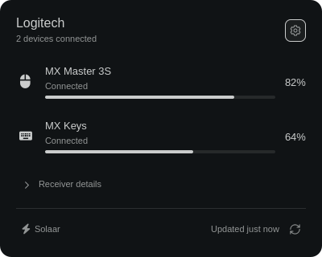

# Foamy Bolt

Logitech receiver and battery status.



## Install

Install Solaar (`solaar`) and make sure it can access your receivers.

```sh
omarchy plugin add https://github.com/foamrider/foamy-bolt.git --enable
```

## Use

- Left-click the widget to see your devices and battery levels.
- Open the cog to choose **List** or **Tiles**, language, and refresh interval.
- Click refresh to update the readings. Right-click the widget to open Solaar.

Supports Bolt, Unifying, and Lightspeed receivers. Direct Bluetooth and USB
devices are not discovered. Pairing and device configuration stay in Solaar.

## License

Licensed under [MIT](LICENSE). Omarchy and Lucide notices are in
[LICENSE-OMARCHY](LICENSE-OMARCHY) and [LICENSE-LUCIDE](LICENSE-LUCIDE).

Provided **as is**, without warranty or guaranteed support. Use at your own risk.
